## OpenGL Rendering Engine (Learning Project)

### Overview

This project was my first dive into OpenGL. I built a simple rendering pipeline that progressed from drawing basic shapes to displaying fully lit and textured 3D models. While it's not a full "engine," it helped me get familiar with the core components of real-time rendering. I've been exposed to computer visualization concepts before (more on that later), so this was a really fun project to actually put all my learning to good use. This project also branched into another side project intended solely for 3D models (made from Blender).

**Tech stack**: `C++` `OpenGL` `GLSL`

---

### 1. Primitive Shapes and Buffers

I started with rendering simple primitives: a triangle, then a square, and finally a cube. This helped me get a handle on OpenGL's VAO, VBO, and EBO system. It's also where I wrote my first Vertex and Fragment shaders for OpenGL. I had written shaders before (HLSL) inside Unity's scriptable pipeline, and GLSL is mostly the same, but nonetheless it was really fun seeing how customizable you can get with no limiting factor like Unity. I also got to apply some cool math in this portion, where I manipulated my objects with rotation equations using transformation matrices, which I learned from a Graphics Book by Fletcher Dunn.

  
*My first triangle rendered using a VAO.*

  
*A rotating cube, textured with an image of my friend's face.*

  
*Multiple rotating cubes, textured with an image of my friend's face!*

---

### 2. Camera System

Next, I added a camera system with basic movement + zoom controls. This made navigating the scene possible and laid the groundwork for interacting with 3D space. It was cool seeing how OpenGL has so much support for Input mapping, which was something I was not expecting going into this project.

  
*Input mapped camera system. (in a more complex scene)*

---

### 3. Textures

Once I had geometry and movement in place, I added texture support. This included loading images, mapping TextureCoords correctly, and testing with multiple textured cubes. I messed around with a new library `stb_image` by Sean Barret. And I learned about Mipmaps and Texture Filtering. I also got to do more work with shaders here, as now I could use the TextureCoords in the color processing.

  
*Totally normal image of my friend, that definitely doesn't have LeBron secretly hidden as an opaque second texture.*

  
*Textured cube, with light mapping.*

---

### 4. Lighting

This was by far my favourite part of the project, which is probably reflected by just how long this text is. I learned a ton about all the many ways lighting can influence an object. Pretty soon after I implemented a basic Phong lighting model, which I learned all about ambient, diffuse, and specular lights. This was a massive highlight for me, as I am obsessed with math, and the calculations required for these lights are so intriguing and intuitive, I could write a whole essay about how much I loved the math behind these techniques, but I'll save you the time.

I spent a ton of time messing around with different values to simulate different materials, which can be found [here](http://devernay.free.fr/cours/opengl/materials.html). After that worked, I added lighting maps (Diffuse, and Specular) to my textures. This really opened my eyes to what’s possible with materials. I then extended the project to support directional light, point lights, and spotlights—all active in one scene.

  
*Directional light diagram, showing how all rays are parallel, meaning light calculation is the same for all rays.*

  
*Point light diagram, showing that as light scatters from its source, it becomes attenuated.*

  
*Spotlight diagram, showing the vector pointing from the fragment to the light, the radius (Phi ϕ), and the dot product of the light direction and the spotlight direction (Theta θ).*

---

### 5. Model Loading with Assimp

I integrated another library: `Assimp` to load external 3D models. This allowed me to render more complex assets with their own defined vertices, faces, meshes and materials. This part was actually pretty straightforward for me, as I had already built up a lot of foundations in the project beforehand. It did involve me making two new classes. I even got to add some pretty advanced stuff in here like tangent-space normal mapping and vertex skinning, but I never got to utilize them.

  
*Simplistic model of Assimp's structure.*

---

### 6. Depth and Stencil Testing

Here I experimented around with depth and stencil testing inside my project. I learned about linear/non-linear depth buffers to calculate depth value precision, and how the depth value is more precise the closer it is to the near plane. I also had fun with some heavy math operations, as calculating the depth values involved a ton of work with the projection matrix, which I learned from this [article](https://www.songho.ca/opengl/gl_projectionmatrix.html).

Afterwards I played around with Stencil Testing, which I felt was super valuable experience. There is a bunch of functions already baked in to OpenGL's library, so I had a ton of settings to explore. I ended up using the stencil buffer to outline various objects within my scene. I made an X-ray, and a "selection" action (like selecting something in a RTS) inside an outlining algorithm.

  
*Near and Far plane of the projection matrix, used in depth value calculations.*

  
*Non-linear graph of the relation between the z-value and the resulting depth buffer's value.*

---

### 7. Blending

This was a really interesting part of the project for me. Although not as math heavy as the previous section, my eyes were still opened by the complexity of blending. I expected this to be a simple chapter, seeing as how the blending equations were quite intuitive and easy to understand, but once I realized how the depth buffer interacts with transparent objects it became much more intriguing.

I started off with some simple fragment discarding, using a grass texture (the grass is on a transparent white background). It involved me mapping normals to the texture, and then modifying the way OpenGL samples textures. OpenGL interpolates the border values with the next repeated value of the texture, but since I'm using transparent values, the top of the texture image gets its transparent value interpolated with the bottom border's solid color value. This results in a white border around the quad. I solved this by setting the Texture Parameter to use `GL_CLAMP_TO_EDGE`.

After that I started on actual blending, using a red window texture. The blending equation is actually really simple—fusing the colors based on the alpha value of the source texture and storing it in the color buffer. OpenGL already had a bunch of functions built for this, so it was really easy.

What wasn't easy though is how these windows interacted with depth testing. I found that when looking through any transparent window, all other windows behind would vanish. This is because when writing to the depth buffer, the depth test does not check if the fragment has transparency or not, therefore it acts as if it is an opaque object. So to make blending work, I had to draw the most distant window first. By sorting the objects based on the distance from my camera's position vector, I solved the issue.

This was really interesting for me because there is a ton of ways people have tried to solve this issue for blending. I used a sorted technique, but I did research into the many order independent transparency (OIT) techniques—both accurate and approximate—which exposed me to some advanced areas of blending (like using framebuffers, or depth peeling).

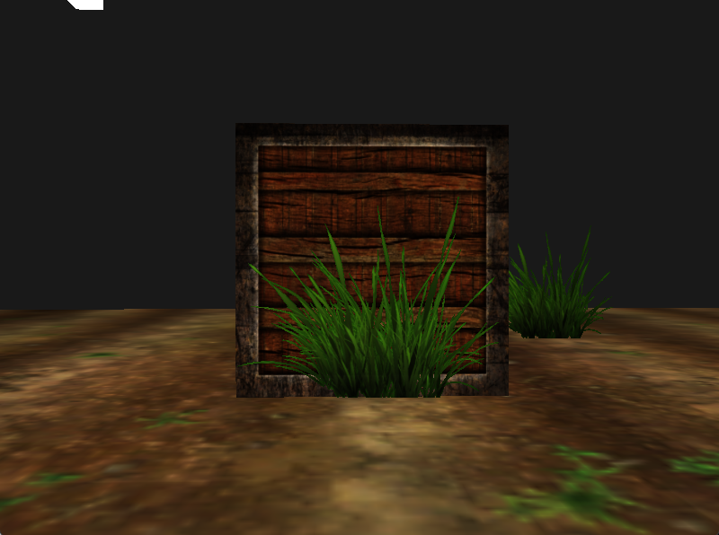  
*Grass texture, rendered by discarding fragments.*

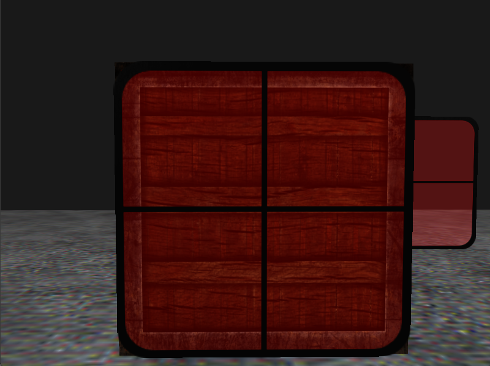  
*Semi-Transparent window, blended with the background container.*

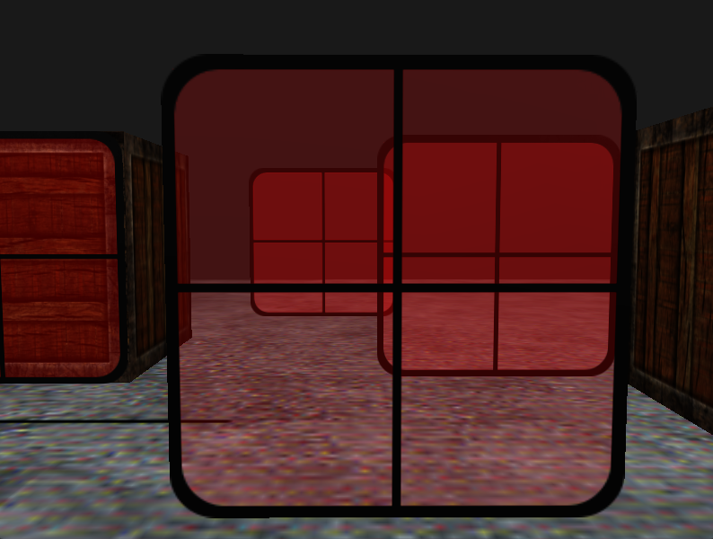  
*Depth testing fix by sorting the order in which transparent objects render.*

---

### 8. Post Processing

This was a pretty exciting section of this project. I got to learn about framebuffers, which are basically a bitmap for the current frame. Framebuffers are cool however, because you can do a bunch of Post processing effects, or Mirrors in your scene.

This works because you are essentially rendering the entire screen into a texture on an invisible quad in front of the camera. I also got to experiment with the different ways you can set up your framebuffer. I ended up creating and using a texture, depth, and stencil buffer all combined into the framebuffer.

Once I had set it up, it was super easy adding post processing effects in the fragment shader. I got to apply some of the math I’ve been learning here—now that I can use Kernel effects, which are just a small matrix-like array of values. I used this [website](https://setosa.io/ev/image-kernels/) to visualize the effects of whatever values are used in the kernel. Overall, the framebuffers are a super helpful tool when programming graphics, so this was a really fun chapter.

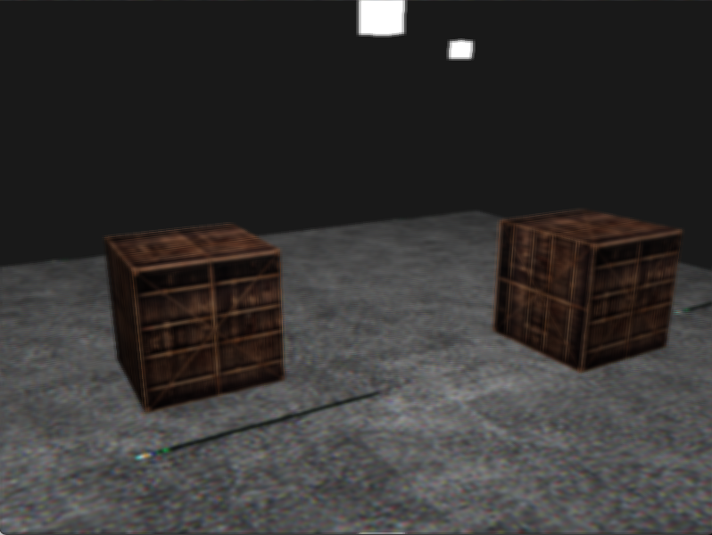  
*Blur effect, using a kernel.*

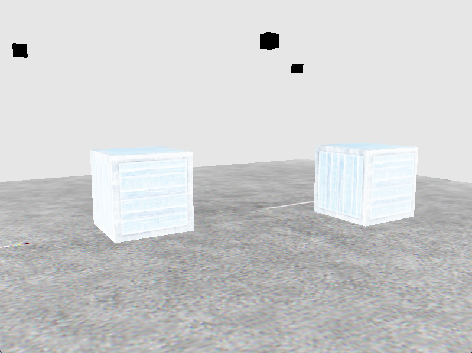  
*Inversion effect, by inverting the texture color.*

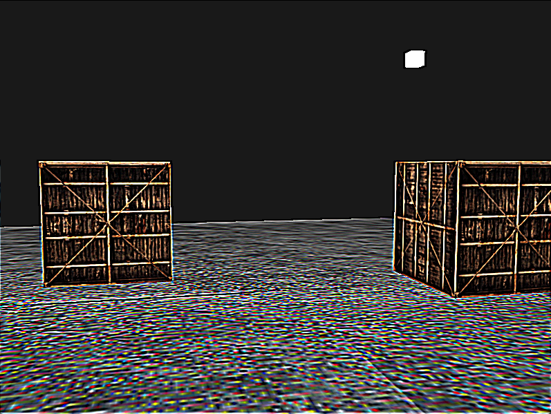  
*Sharpen effect, to simulate an Acid trip.*

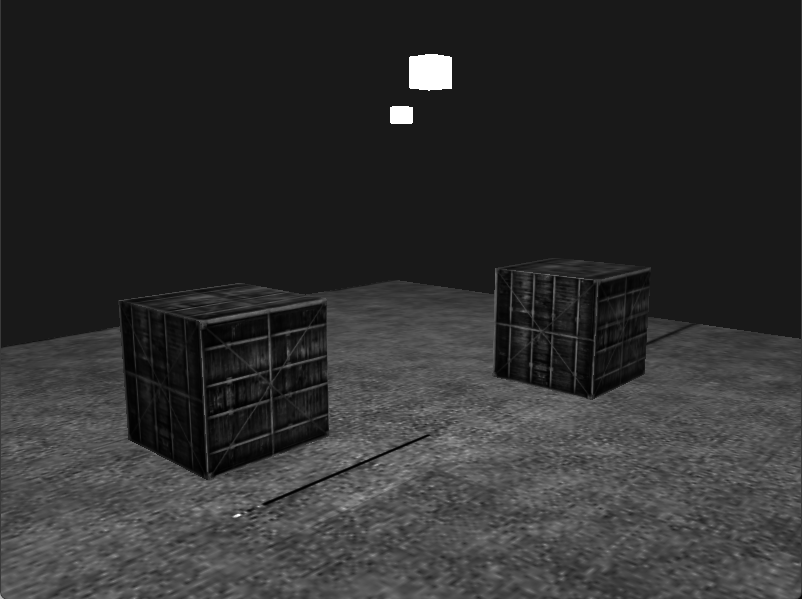  
*Grayscaled effect, by averaging the RGB values, and accounting for the human eye's sensitivity to green.*

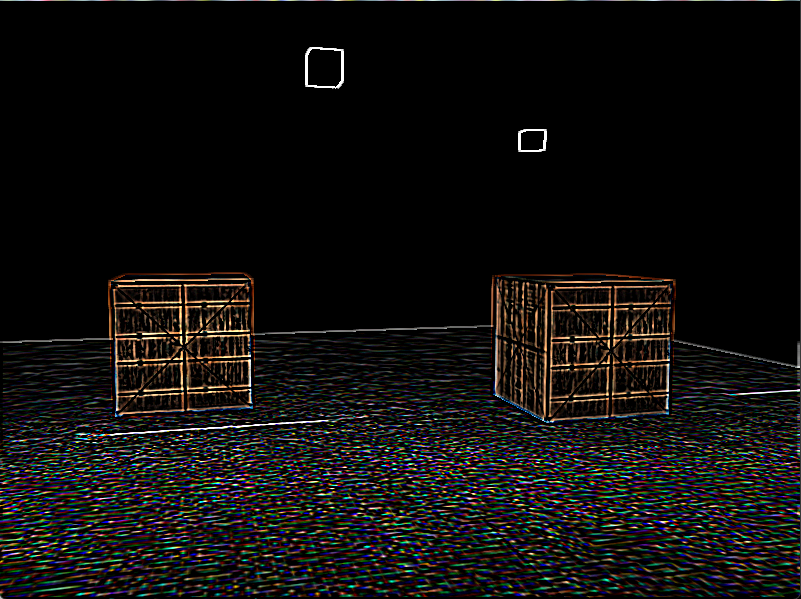  
*Edge detection, which is similar to the sharpen kernel, but darkens the surroundings.*

---

### 9. Cubemaps and Environmental Mapping

I finally got to do some major changes to the scene during this section! I first added a skybox, which was rendered using a cubemap, and was pretty straightforward. But where this got really fun was messing around with environmental mapping.

I got to do some fun calculations for reflection and refraction techniques. This type of math is always my favorite, as it uses vectors and normals to calculate and draw a reflection/refraction vector that maps to texture coordinates. These parts always feel so satisfying because it's when all of my previous work on the project comes together to form the remaining pieces of the puzzle. I 100% left this part feeling satisfied in my work so far.

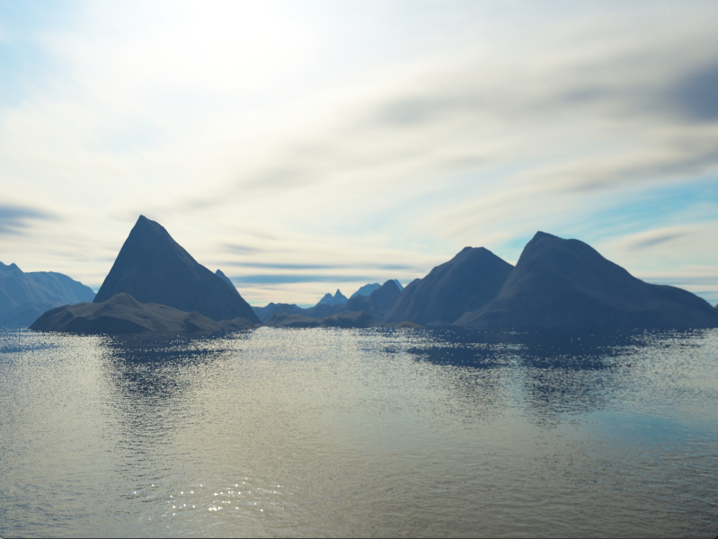  
*Skybox cubemap rendering in the scene.*

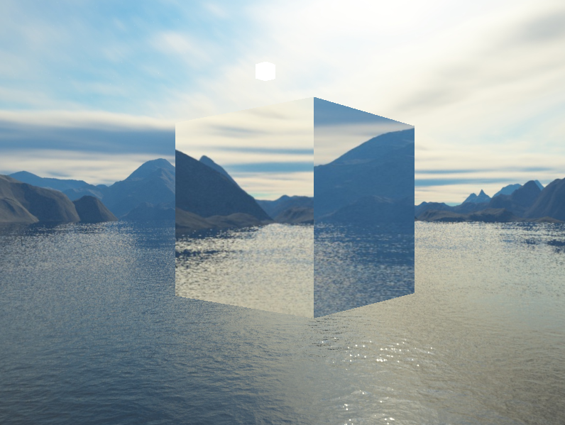  
*Environmental mapping, reflecting the environment around the cube.*

  
*Reflection theory diagram. Detailing the view direction vector **I**, the Normal vector of the cube **N**, and the reflection vector **R** which finds the texture coords of the cubemap.*

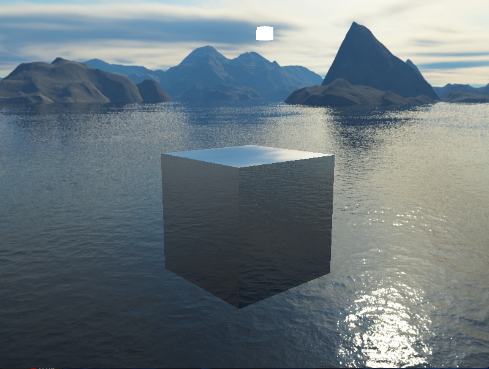  
*Environmental mapping, refracting the light from the environment around the cube.*

  
*Refraction theory diagram. Detailing Snell's law, containing the view direction vector **I**, the Normal vector of the refractive object **N**, and the refraction vector **R** which finds the texture coords of the cubemap.*

---

### Learning Process

Even though this was my first OpenGL project, I had a solid foundation going in. I'd already read _3D Math Primer for Graphics and Game Development_ (Fletcher Dunn) and _Foundations of Game Engine Development_ by Eric Lengyel, as well as a strong theoretical understanding of linear algebra from Gilbert Strang's textbooks. Those books helped a lot with the math side of things.

Throughout the project, I followed the LearnOpenGL tutorials. Thanks to the reading I'd done beforehand, the material clicked pretty quickly, and I was able to apply it in my own setup without just copying the code.

---

### Source Code & GitHub History

All the code for this project is available on my GitHub repository, including the full source, shaders, and supporting assets. You can actually follow along with how I built each part of the renderer from the ground up, step by step by checking out the Commit Graph. It's a pretty honest snapshot of how I approached the project and how it evolved over time.
